# 🌟 Athar

A modern full-stack charity platform that connects donors with verified charity organizations through a transparent, fast, and user-friendly digital experience. Athar empowers organizations to manage fundraising campaigns, publish media updates, and engage donors through a secure and efficient ecosystem.

---

## 🧰 Tech Stack & Icons

<p align="center">
  &nbsp;
  &nbsp;
  &nbsp;
  &nbsp;
  &nbsp;
  &nbsp;
  &nbsp;
  &nbsp;
  &nbsp;
  &nbsp;
  
</p>

---

## 📌 Table of Contents

1. [About Athar](#about-athar)  
2. [Core Features](#core-features)  
3. [System Architecture](#system-architecture)  
4. [Getting Started](#getting-started)  
5. [Database & Seeding](#database--seeding)  
6. [API Overview](#api-overview)  
7. [Development Architecture](#development-architecture)  
8. [Authors](#authors)  
  

---

## ✨ About Athar

Athar is a digital charity ecosystem designed to enhance transparency, build trust, and provide donors with a seamless experience when contributing to verified fundraising campaigns.  
The platform empowers charity organizations to:

- Create and manage fundraising campaigns  
- Publish real-time updates through a media center  
- Engage with donors through a secure notification system  
- Track campaign progress and donations  

Athar aims to modernize donation workflows and support impactful charity operations.

---

## 💡 Core Features

### 🧾 Charity Registration & Management
- Verified onboarding process  
- Charity admin panel  
- Manage campaigns & donations  

### 🎯 Fundraising Campaigns
- Create campaigns with goal, duration, and description  
- Track donation progress live  
- Auto-status updates (Completed / Running / Expired)  

### 🖼️ Media Center
- Post updates (images only, no videos)  
- Donors can like posts (no comments yet)  

### 🔔 Notification System
- Charity approved / rejected  
- New campaign created  
- New media update  
- New donation received  
- Background worker processing queued notifications  

### 💳 Donation Flow
- Secure online donations  
- Transaction tracking  
- Auto-updating raised amount  

### 👤 Role-Based Access
- Donor  
- Charity Owner  
- Platform Admin  

### 🤝 Volunteers & Business Offers
- Charity can open volunteer requests  
- Businesses can submit offers for campaigns to optimize cost  

---

## 🖼️ System Architecture

```mermaid
flowchart TB

    %% PYRAMID STACK

    A(["Frontend Layer<br/>React – HTML/CSS/JS – Bootstrap"])
    B(["Backend Layer<br/>ASP.NET Core 8"])
    C(["Database Layer<br/>PostgreSQL (Neon Cloud)"])

    A --> B
    B --> C

    %% STYLE
    style A fill:#e3f2fd,stroke:#2196f3,stroke-width:2px,color:#000
    style B fill:#e8f5e9,stroke:#43a047,stroke-width:2px,color:#000
    style C fill:#fff3e0,stroke:#fb8c00,stroke-width:2px,color:#000


```



## ⚙️ Getting Started

1. **Clone the repository:**
   ```bash
   git clone git clone https://github.com/Omarioooo/Athar.git
   cd athar
   ```

2. **Restore dependencies:**
   ```bash
   dotnet restore
   ```

3. **Run the application:**
   ```bash
   dotnet run
   ```
   
4. **Open your browser:**
   ```bash
   https://localhost:5192
   ```

##  Local Data Seeding (101 charities + 23 campaigns)

- On first run in `Development`, the API seeds the scraped dataset in the background from `AtharPlatform/AtharPlatform/SeedData/`.
- Seeding is idempotent: existing items (by ExternalId or exact name/title) are skipped.
- First run can take ~30–90s: Identity user creation hashes passwords and EF writes 100+ rows.
- To skip seeding (faster startup), set env var before running:

   ```powershell
   $env:SKIP_SCRAPED_SEED="1"; $env:ASPNETCORE_ENVIRONMENT="Development"; dotnet run --project Athar/AtharPlatform/AtharPlatform/AtharPlatform.csproj
   ```

- Manual import is also available via a script that calls the protected import endpoints:

   ```powershell
   # Default paths point to SeedData JSONs tracked in the repo
   powershell -File scripts/import.ps1 -BaseUrl "https://localhost:7032"
   ```

Data files included and tracked:
- `AtharPlatform/AtharPlatform/SeedData/charities101.json`
- `AtharPlatform/AtharPlatform/SeedData/campagins23.json`

## 📡 API Overview

- RESTful API endpoints for all features
- Secure endpoints with role-based access


## 🧑‍💻 Development Architecture

- Clean Architecture with separation of concerns
- Repository Pattern & Unit of Work for data access
- DTOs and AutoMapper for mapping between layers
- FluentValidation for request validation
 ---
🎥 Website Explanation Video

watch a full explanation of the website : https://drive.google.com/file/d/1vk_ztuCkso5OSW4xnMTEzrNFhMJTQ14J/view?usp=sharing

 ---
 👥 Authors

Omar Mohamed —  [GitHub](https://github.com/Omarioooo)    | [Email](omarrmohammed86@gmail.com) 

Youssef Waeel — [GitHub](https://github.com/KaIosha)      | [Email](youssef.waeel.haroon@gmail.com)

Gihadelrwiny —  [GitHub](https://github.com/gihadelrwiny) | [Email](fayezrowan5@gmail.com)

Rowan Fayez —  [GitHub](https://github.com/RowanFayez)    | [Email](fayezrowan5@gmail.com)

---
Thanks for visiting Athar!  
We welcome contributions, feature ideas, and feedback to help push the platform forward.  
Together, we can build technology that creates real impact. 🌍


---
